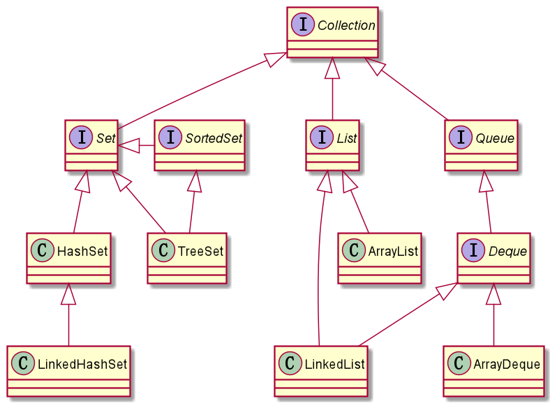
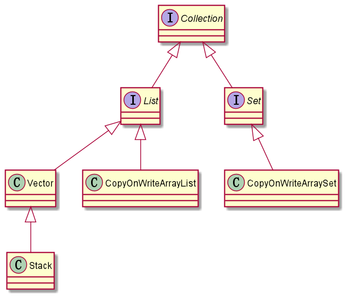
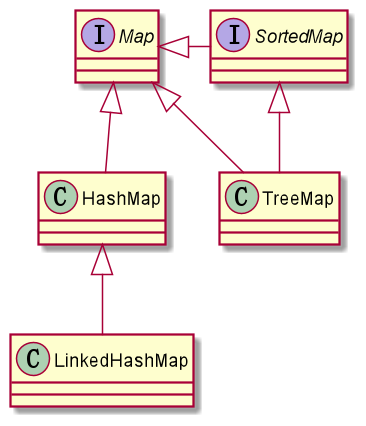
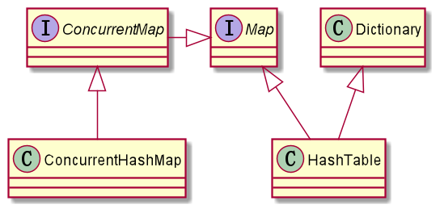
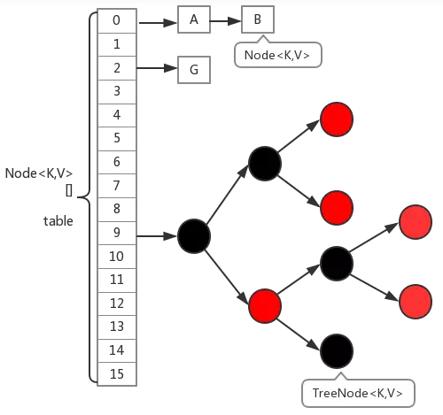

# <font color="orange">Java 集合底层原理剖析</font>

## 1. Java 集合介绍

Java 集合是一个存储相同类型数据的容器，类似数组，集合可以不指定长度，但是数组必须指定长度。集合类主要从 **Collection** 和 **Map** 两个根接口派生出来，比如常用的 ArrayList、LinkedList、HashMap、HashSet、ConcurrentHashMap 等等。

-   Collection 根接口框架简化结构图<small>（线程不安全）</small>：

    

-   Collection 根接口框架简化结构图<small>（线程安全）</small>：

    

-   Map 根接口框架简化结构图（线程不安全）：

    

-   Map 根接口框架简化结构图（线程安全）：

    


## 2. List

List 体系在 JDK 1.0 的时候就已经存在了。<small>作为它的兄弟，Set 接口反而是在 JDK 1.2 中才被补充进集合框架。</small>

```
Collection                   (jdk 1.0)
└── List                     (jdk 1.0)
    |── Vector / Stack       (jdk 1.0)
    |── ArrayList            (jdk 1.2)
    |── LinkedList           (jdk 1.2)
    └── CopyOnWriteArrayList (jdk 1.5)
```

### 2.1 Vector

    线程安全
    底层使用『动态数组』实现


**Vector** 是第一波<small>（JDK 1.0）</small>出现的 List 接口的实现类，这批实现类都是线程安全的。

> JDK 1.5 通过 J.U.C 对 JDK 1.0 的这波线程安全的实现类提出了大范围的替换。
> 
> 在未来<small>（JDK 1.5 中）</small>，顶替 Vector 的就是 CopyOnWriteArrayList 。

Vector 的底层是通过『**动态数组**』实现的。『动态数组』是指当数组容量不足以存放新的元素时，会创建新的数组，然后把原数组中的内容复制到新数组。

**特征**：

1. 允许添加 null 值，且允许添加多个；
2. 查询效率高、插入、删除效率低，因为需要移动元素；
3. 默认的初始化大小为 10，默认扩容系数是 1。<small>如果扩容后还不够，则以实际需要扩容</small>；
4. 线程安全。<small>带来的代价是，在单线程环境下白白付出性能损耗。</small>

**使用场景**：多线程环境


### 2.2 Stack

    线程安全
    Vector 的子类，底层使用『动态数组』实现

Stack 和 Vector 一样，也是第一批<small>（JDK 1.0）</small>出现的 List 接口实现类，而且，它还是 Vector 的子类。

由于 Stack 是 Vector 的子类的关系，因此，显而易见，Stack 也是线程安全的，且底层也是使用『动态数组』实现的。

JDK 中 Stack 的类对应的是数据结构中的『栈』的概念，实现先入先出<small>（FIFO）</small>功能。

> 在 Stack 不推荐使用之后，逻辑上，在 Java 集合框架中现在是没有现成的『栈』的。数据结构中的『队列』和『栈』，在 Java 集合框架中都是通过使用『**双端队列**』来实现功能。

**实现原理**：

1. Stack 执行 push() 时，将数据推进栈，即把数据追加到数组的末尾。
2. Stack 执行 peek 时，取出栈顶数据，不删除此数据，即获取数组首个元素。
3. Stack 执行 pop 时，取出栈顶数据，在栈顶删除数据，即删除数组首个元素。
4. Stack 继承于 Vector，所以 Vector 拥有的属性和功能，Stack 都拥有，比如 add()、set() 等等。


### 2.3 ArrayList

    线程不安全
    底层使用动态数组实现

ArrayList 是第二波<small>（JDK 1.2）</small>出现的 List 接口的实现类。<small>这批接口主要都是线程不安全版的实现。</small>

由于是基于『**动态数组**』实现的，所以，ArrayList **随机访问效率高**，随机插入、随机删除效率低。

> 在 JDK 1.5 之前，ArrayList 对标的是 Vector，它俩一个是 List 的线程不安全实现，一个是线程安全实现。在 JDK 1.5 推出 J.U.C 之后，ArrayList 对标的就是 CopyOnWriteArrayList 。
> 
> 另外，还可以使用 `Collections.synchronizedList(list)` 函数返回一个线程安全的 ArrayList 类。


**特征**：

1. 允许添加 null 值，且允许添加多个；
2. 查询效率高、插入、删除效率低，因为大量 copy 原来元素；
3. 线程不安全。

**使用场景**：

1. 需要快速随机访问元素
2. 单线程环境

**注意事项**：

1. `new ArrayList()` 创建对象时，如果没有指定集合容量则初始化为 0；如果有指定，则按照指定的大小初始化；
2. 扩容时，先将集合扩大 1.5 倍，如果还是不够，则根据实际长度来扩容，保证都能存储所有数据，比如 `addAll()` 场景。
3. 如果新扩容后数组长度大于（Integer.MAX_VALUE-8），则抛出 OutOfMemoryError。

### 2.4 LinkedList

    线程不安全
    底层使用『双向链表』实现

LinkedList 和 ArrayList 是“双胞胎”，它和 ArrayList 都是同一波<small>（JDK 1.2）</small>出现的 List 接口的实现类。这波实现类都是线程不安全的。

它俩的区别仅在于底层用到的数据结构上。

另外，LinkedList 比 ArrayList 多实现了『别的』接口<small>（Deque 接口）</small>，因此，它的功能要比 ArrayList 要『多』。

因此，ArrayList 和 LinkedList 的使用上的定位有所不同：

- ArrayList 更像是一个纯 List；
- LinkedList 更多的要扮演数据结构中的『队列』和『栈』的角色。


**特征**：

1. 允许添加 null 值，且允许添加多个；
2. 插入和删除效率高，查询效率低；
3. 顺序访问会非常高效，而随机访问效率<small>（比如 get 方法）</small>比较低；
4. 因为还『多』实现了 Deque 接口，因此功能比兄弟 ArrayList 更多：能实现数据结构中的栈和队列的功能。
5. 线程不安全。


**使用场景**：

1. 需要快速插入，删除元素按照顺序访问其中的元素
2. 单线程环境


### 2.5 CopyOnWriteArrayList

    线程安全
    底层使用『动态数组』实现

**CopyOnWriteArrayList** 是第三批<small>（JDK 1.5）</small>出现的 List 接口的实现类。这批实现类的主要目的是替换掉早期<small>（JDK 1.0）</small>的线程安全版的实现，以提供能好的并发性能。 所以，这批实现类都是线程安全的。

CopyOnWriteArrayList 要替换掉的对象就是 Vector 。

> 另外，除了 CopyOnWriteArrayList 和 Vector 来获得线程安全版的 List之外，你还可以使用 `Collections.synchronizedList(List list)` 来获得线程安全版的 List 。


**特征**：

1. 线程安全；
2. 读多写少，比如缓存；
3. 不能保证实时一致性，只能保证最终一致性。

**缺点**：

1. 写操作，需要拷贝数组，比较消耗内存，如果原数组容量大的情况下，可能触发频繁的 Young GC 或者 Full GC；
2. 不能用于实时读的场景，因为读取到数据可能是旧的，可以保证最终一致性。

**实现原理**：

1. CopyOnWriteArrayList 写操作加了锁，不然多线程进行写操作时会复制多个副本；
2. 写操作<small>（add、set、remove 等等）</small>时，把原数组拷贝一份出来，然后在新数组进行写操作，操作完后，再将原数组引用指向到新数组。
3. 读操作没有加锁，所以可以实现并发读，但是可能读到旧的数据，比如正在执行读操作时，同时有多个写操作在进行，遇到这种场景时，就会都到旧数据。


### 2.6 ArrayList、LinkedList 和 Vector 三者的区别

历史发展层面：

| List 的实现   | 诞生 |
| :-            | :- |
| Vector<small>（Stack）</small> | JDK 1.0 |
| ArrayList     | JDK 1.2 |
| LinkedList    | JDK 1.2 |

线程安全层面：

| List 的实现       | 线程安全 |
| :-                | :- |
| Vector<small>（Stack）</small> | Y |
| ArrayList         | N |
| LinkedList        | N |

底层数据结构层面：

| List 的实现       | 底层实现 |
| :-                | :- |
| Vector<small>（Stack）</small> | 动态数组 |
| ArrayList         | 动态数组 |
| LinkedList        | 双向链表 |


其它小区别：

1. 扩容问题：ArrayList 默认扩容 1.5 倍；Vector 默认扩容 1 倍；LinkedList 不存在扩容问题。
2. 效率问题：由于底层数据结构原因，ArrayList、Vector 访问更快；LinkedList 增删更快。
3. 内存开销问题：由于底层数据结构原因，ArrayList、Vector 内存内开销更小，但需要是连续内存空间；LinkedList 内存开销更大，但无需连续内存空间。


## 3. Map

Map 体系在 JDK 1.0 的时候就已经存在了，在当时是集合框架的两条腿之一<small>（另一条腿是 List 体系，而 Set 体系在 JDK 1.2 才出现）</small>。


```
Map                    (jdk 1.0)
|── Hashtable          (jdk 1.0)
|── TreeMap            (jdk 1.2)
|── HashMap            (jdk 1.2)
|   └── LinkedHashMap  (jdk 1.4)
└── ConcurrentHashMap  (jdk 1.5)
```

Map 结构是以 key-value 键值对形式存储数据。


### 3.1 HashTable

    线程安全
    底层使用『数组+链表』实现

Hashtable 是最早一批<small>（JDK 1.0）</small>出现的 Map 接口的实现类。这批实现类都是线程安全的。

> JDK 1.5 通过 J.U.C 对 JDK 1.0 的这波线程安全的实现类提出了大范围的替换。
> 
> 在未来<small>（JDK 1.5 中）</small>，顶替 Hashtable 的就是 ConcurrentHashMap 。

除了实现 Map 接口，Hashtable 还继承了 Dictionary 类。<small>这是它的兄弟姐妹们所没有的特征。</small>

特征：

- key 和 value 都不允许为 null。<small>这一点更像是设计缺点，在后面出现的 Map 实现类中，对于这一点都做出了『修正』</small>；
- Hashtable 默认的初始大小为 11，之后每次扩充为原来的 2 倍；
- 线程安全。


### 3.2 HashMap

    线程不安全
    底层使用『数组+链表+红黑树』实现

HashMap 是第二批<small>（JDK 1.2）</small>出现的 Map 接口的实现类。这波实现类出现的目的主要是为了填补集合框架中缺少非线程安全版的实现，因此这一批实现类主要都是线程不安全的。

另外，JDK 8 中对 HashMap 的底层实现做出了较大的变动<small>（升级）</small>，其中最大的改动就是引入了红黑树。当链表长度 `>=8` 时，并且同时数组的长度 `>=64` 时，链表就转换为红黑树，利用红黑树快速增删改查的特点提高 HashMap 的性能。



HashMap 使用链地址法解决哈希冲突。

**特征**：

1. 认为 `null` 是合法的 key 值；但是整个 Map 中 key 为 `null` 的键值对最多只能有一个。

2. 认为 `null` 是合法的 value 值，且可以有多个键值对的 value 为 null 。

2. 查询、插入、删除效率都高<small>（集成了多方特性）</small>

3. 线程不安全

4. 用到了一个编程小技巧：用位运算（&）来代替取模运算（%）

   > 当 b 的值为 2^n 时，`a % b` 和 `a ^ (b-1)` 的值相等。这样效率更高，并且可以解决负数问题<small>（负数模运算取余，余数应该始终为正数）</small>。

**使用场景**：

1. 快速增删改查
2. 随机存取
3. 缓存


### 3.3 ConcurrentHashMap

    线程安全
    底层使用『数组 + 链表 + 红黑树』实现

ConcurrentHashMap 是第三批<small>（JDK 1.5）</small>添加到集合框架中的 Map 接口的实现。这批实现类出现的主要目的是为了替换之前<small>（JDK 1.0）</small>中的线程安全版的实现。因此，这批实现类主要都是线程安全的。

ConcurrentHashMap 要替换的就是 Hashtable 。

在 Java 8 版本中，ConcurrentHashMap 有比较大的变动<small>（更新升级）</small>，采用 CAS + Synchronized 实现锁操作，以确保线程安全。

**使用场景**：并发、线程不安全场景


### 3.4 HashMap、Hashtable、ConccurentHashMap 三者的区别

历史发展层面：

| List 的实现       | 诞生 |
| :-                | :- |
| Hashtable         | JDK 1.0 |
| HashMap           | JDK 1.2 |
| ConccurentHashMap | JDK 1.5 |

线程安全层面：

| Map 的实现       | 线程安全 |
| :-                | :- |
| Hashtable         | 线程安全<small>（Synchronized 实现）</small> |
| HashMap           | 线程不安全 |
| ConccurentHashMap | 线程安全<small>（CAS + Synchronized 实现）</small> |

底层数据结构层面：

| List 的实现       | 底层实现 |
| :-                | :- 
| Hashtable         | 数组 + 链表 |
| HashMap           | 数组 + 链表 + 红黑树 |
| ConccurentHashMap | 数组 + 链表 + 红黑树 |


其它小细节：

- 最早出现的 Hashtable 和它的替代者 ConccurentHashMap 不允许 key 和 value 为 `null` ；HashMap 则可以，HashMap 允许 key 和 value 为 `null` 。

### 3.5 TreeMap

    线程不安全
    底层使用『红黑树』实现

TreeMap 和 HashMap 一起都是第二批<small>（JDK 1.2）</small>出现的 Map 接口的实现类。这批实现类的出现主要是为了填补集合框架体系中没有 Map 的线程不安全版的缺失。因此，它们都是线程不安全的。


TreeMap 除了实现了 Map 接口，它还实现了 SotredMap 接口，意味着可以排序，是一个有序的集合，你添加进 TreeMap 中的数据会被它自动排序。

底层数据结构是红黑树结构，TreeMap 中的每个元素都存放在红黑树的节点上，默认使用自然排序，也可以自定排序，线程不安全。


### 3.6 LinkedHashMap

    线程不安全
    底层使用『数组 + 链表 + 红黑树』实现


LinkedHashMap 并不是在关键节点<small>（JDK 1.0、1.2 和 1.5）</small>添加进集合框架的，它是在 JDK 1.4 的时候添加进集合框架的。<small>看起来像个补丁。</small>

LinkedHashMap 继承自 HashMap ，它在 HashMap 的基础上用链表额外去『串』起了所有的节点，这样就能记录下添加到 LinkeHashMap 中的数据的添加顺序，从而保证了迭代顺序和添加顺序的一致。


### 3.7 HashMap 与 Hashtable 的区别

历史发展层面：

| Map 的实现    | 诞生 |
| :-            | :- |
| HashTable     | JDK 1.0 |
| HashMap       | JDK 1.2 |

线程安全层面：

| Map 的实现    | 线程安全 |
| :-            | :- |
| HashTable     | Yes |
| HashMap       | No |

底层数据结构：

| Map 的实现| 底层实现 |
| :-        | :- |
| Hashtable | 数组 + 链表 |
| HashMap   | 数组 + 链表 + 红黑树 |


其它小细节：

1. Hashtable 除了实现 Map 接口外，还继承了 Dictionary 类；HashMap 则没有。
2. Hashtable 认为 `null` 是非法 key；HashMap 则认为 null 作 key 合法。<small>不过，HashMap 只允许有一个 key 为 null 的键值对。</small>
3. Hashtable 认为 `null` 是非法 value; HashMap 则认为 null 作 value 合法。
4. `key.hashCode()` 算法中，Hashtable 用的 `%` 运算；HashMap 用上了一个编程小技巧，使用 `&` 运算
5. 两者初始容量不同，Hashtable 默认 11；HashMap 大一点，默认 16 。

### 3.8 HashMap 与 TreeMap 的区别

**历史发展层面**： 它俩都是在 JDK 1.2 引入到集合框架中的。

**线程安全层面**：它俩都是线程不安全的。

**底层数据结构**：

| Map 的实现| 底层实现 |
| :-        | :- |
| HashMap | 数组 + 链表 + 红黑树，无序  |
| TreeMap | 红黑树，有序 |

**其它小细节**：

- HashMap 认为 null-key 合法；TreeMap 则认为 null-key 非法。

- HashMap 效率略高；TreeMap 效率略低。

## 4. Set

整个 Set 体系是在第二波<small>（JDK 1.2）</small>才被添加进集合框架中的，看起来，它好似 List 的兄弟，但是实际上，它出现地要比 List<small>（和 Map）</small>晚。

由于在集合框架的第一波<small>（JDK 1.0）</small>中并没有 Set 体系，因此 Set 体系在线程安全的实现上，就没有想 List 和 Map 一样『走弯路』：

- JDK 1.2 中引入是 Set 的线程不安全实现；

- 在 JDK 1.5<small>（J.U.C）</small>中引入的是 Set 的线程安全实现。


```
Set                     (jdk 1.2)
|── TreeSet             (jdk 1.2)
|── HashSet             (jdk 1.2)
|   └── LinkedHashSet   (jdk 1.4)
└── CopyOnWriteArraySet (jdk 1.5)
```

一个既有意思又重要的现象：虽然 Set 看起来和 List 更亲<small>（都是 Collection 接口的子接口）</small>，但是 Set 的各种实现类底层却是『**利用 Map**』实现的自己的功能。


### 4.1 HashSet

    线程不安全
    底层用 HashMap 实现。根本结构是数组+链表+红黑树。

HashSet 是用来存储没有重复元素的集合类，并且是无序的。<small>或者说，你可以添加重复元素，但是从第二次添加开始，你加了也白加。</small>

由于 HashSet 底层利用的是 HashMap 实现，因此你添加到 HashSet 中的值，都被它添加到一个 HashMap 中作了 key：

- 由于 HashMap 的 key 不能重复，所以 HashSet 中的值自然也就是不能重复的；
- 由于 HashMap 允许 null-key，所以 HashSet 中也可以添加一个 null 。

**使用场景**：去重、不要求顺序


### 4.2 TreeSet

    线程不安全
    底层使用 TreeMap 实现，因此根本结构是『红黑树』。

TreeSet 除了实现 Set 接口，它还实现了 SortedSet 接口，意味着可以排序，它是一个有序并且没有重复的集合类。<small>TreeMap 是有序的，因此 TreeSet 自然也就是有序的。</small>

由于 TreeSet 底层利用的是 TreeMap 实现，因此你添加到 TreeSet 中的值，都被它添加到一个 TreeMap 中作了 key：

- TreeMap 是内部有序的，TreeSet 自然也就是内部有序的；

- TreeMap 不允许添加 null-key，TreeSet 自然也就不允许添加 null 值。

TreeSet 支持两种排序方式：自然排序<small>（默认）</small>和自定义排序。

**使用场景**：去重、要求排序


### 4.3 LinkedHashSet

    线程不安全
    HashSet 的子类，底层利用了 LinkedHashMap，因此根本结构是『数组+链表+红黑树』。

由于 LinkedHashSet 底层利用了 LinkedHashMap，因此：

- LinkedHashMap 是 JDK 1.4 中出现的；LinkedHashSet 自然也是 JDK 1.4 才出现的；
- LinkedHashMap 能记录元素的添加次序，LinkedHashSet 自然也就能记录 元素的添加次序。

**使用场景**：去重、需要保证插入或者访问顺序


### 4.4 HashSet、TreeSet、LinkedHashSet 的区别

**历史发展层面**：

| Set 的实现    | 诞生 |
| :-            | :- |
| HashSet       | JDK 1.2 |
| TreeSet       | JDK 1.2 |
| LinkedHashSet | JDK 1.4 |

**线程安全层面**：他们三个都是线程不安全的。

底层数据结构：

| Set 的实现| 底层实现 |
| :-        | :- |
| HashSet       | 利用了 HashMap，去重 |
| TreeSet       | 利用了 TreeMap，去重 + 内部有序 |
| LinkedHashSet | 利用了 LinkedHashMap，去重 + 外部有序 |


### 4.5 CopyOnWriteArraySet

    线程安全
    底层利用的是 CopyOnWriteArrayList 

CopyOnWriteArraySet 是 JDK 1.5<small>（J.U.C）</small>引入的 Set 接口的线程安全实现。

**特征**：线程安全读多写少，比如缓存不能存储重复元素。


## 5. 队列（Queue）

Queue 体系比较『新』。**Queue** 接口在 JDK 1.5 才引入到 JDK 集合框架体系，它的子接口 **Deque** 接口在 JDK 1.6 的时候才补充进 JDK 。

Deque 继承自 Queue ，是一个既可以在头部操作元素，又可以为尾部操作元素，俗称为双端队列。

> 在数据结构领域，Queue 是一个先入先出<small>（FIFO）</small>的集合。


在集合框架中它分为 3 大类：

- 非阻塞队列：普通队列<small>（Queue、Deque）</small>

- 阻塞队列<small>（BlockingQueue）</small>

- 其它队列：主要是优先级队列 <small>（PriorityQueue）</small>


**其它队列<small>（主要是优先级队列）</small>**

```
Collection
└── Queue
    |── PriorityQueue
    └── PriorityBlockingQueue
```

### 5.1 非阻塞队列<small>（普通队列）</small>

非阻塞队列<small>（普通队列）</small>主要指的是 Queue 接口<small>（JDK 1.5）</small>和 Deque 接口<small>（JDK 1.6）</small>的直接实现类。

```
Collection
└── Queue
    |── ConcurrentLinkedQueue       基于链表，线程安全
    └── Deque 
        |── ArrayDeque              基于动态数组，线程不安全
        |── LinkedList              基于链表，线程不安全
        └── ConcurrentLinkedDeque   基于链表，线程安全
```

**Queue 接口定义<small>（引入）</small>的方法包括：**

|           | Throws exception  | Returns special value |
| :-        | :-                | :-                    |
| Insert    | add(e)            | offer(e)              |
| Remove    | remove()          | poll()                |
| Examine   | element()         | peek()                |

**Deque 接口定义<small>（引入）</small>的方法包括：**

|           | Throws exception  | Special value | Throws exception  | Special value |
| :-        | :-                | :-            | :-                | :-            |
| Insert    | addFirst(e)       | offerFirst(e) | addLast(e)        | offerLast(e)  |
| Remove    | removeFirst()     | pollFirst()   | removeLast()      | pollLast()    |
| Examine   | getFirst()        | peekFirst()   | getLast()         | peekLast()    |


在引入 Deque 接口之后，JDK 很是器重它，一方面 Deque 的功能涵盖了 Queue 的功能，另一方面，数据结构中的『栈』和『队列』都可以通过 Deque 统一实现。


**Queue VS Deque：**

| Queue Method  | Equivalent Deque Method   |
| :-            | :-                        |
| add(e)        | addLast(e)                |
| offer(e)      | offerLast(e)              |
| remove()      | removeFirst()             |
| poll()        | pollFirst()               |
| element()     | getFirst()                |
| peek()        | peekFirst()               |


**Stack VS Deque：**

| Stack Method | Equivalent Deque Method    |
| :-            | :-                        |
| push(e)       | addFirst(e)               |
| pop()         | removeFirst()             |
| peek()        | peekFirst()               |


### 5.2 阻塞队列

阻塞队列在队列功能的基础上提供了『阻塞当前线程』的能力：在空队列获取元素时、或者在已存满队列存储元素时，都会被阻塞当前线程。**阻塞队列全部都是线程安全的。**

**阻塞队列体系**：

```
Collection
└── Queue
    |── BlockingQueue 
    |   |── LinkedBlockingQueue     基于链表
    |   |── ArrayBlockingQueue      基于动态数组
    |   └── SynchronousQueue        基于 CAS 的阻塞队列。                     |
    └── Deque
        └── BlockingDeque
            └── LinkedBlockingDeque 基于链表，双端队列
```

BlockingQueue 接口引入了一套新的 API，它和 Queue 的那套 API 是独立的，互不影响，不要调用错了。

|           | Throws exception  | Special value | Blocks            | Times out             |
| :-        | :-                | :-            | :-                | :-                    |
| Insert    | add(e)            | offer(e)      | put(e)            | offer(e, time, unit)  |
| Remove    | remove()          | poll()        | take()            | poll(time, unit)      |
| Examine   | element()         | peek()        | not applicable    | not applicable        |


### 5.3 其它队列（优先级队列）

PriorityQueue 是基于最小二叉堆实现的数据结构。内部以自然顺序排序。

常见的 PriorityQueue 是线程非安全的，PriorityBlockingQueue 是线程安全的。它俩底层数据结构是一样的。

```
Collection
└── Queue
    |── PriorityQueue
    └── BlockingQueue
        └── PriorityBlockingQueue
```

